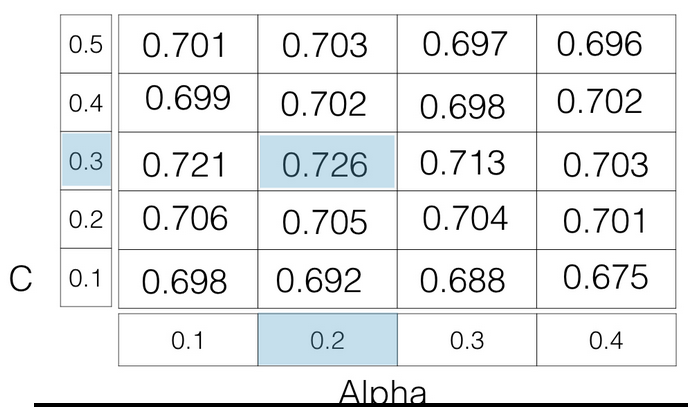

# Regression

opdel datasæt i 'features' og target': 
``` python
X = bosten.drop('MEDV', axis=1).values // dropper 'target', kun features er tilbage
y = boston['MEDV'].values // beholder kun 'target'
```

## Linear regression

```
import numpy as np
from sklearn.linear_model import LinearRegression

reg = LinearRegression()
reg.fit(X_rooms, y)

prediction_space = np.linspace(min(X_rooms), max(X_rooms)).reshape(-1,1)

plt.scatter(X_rooms, y, color='blue')
plt.plot(prediction_space, reg.predict(prediction_space), color='black', linewidth=3)
plt.show()
```


``` python
from sklearn.model_selection import train_test_split
from sklearn.linear_model import LinearRegression

X_train, X_test, y_train, y_test = train_test_split(X, y, test-size= 0.3, random_state=42)

reg_all = LinearRegression()
reg_all.fit(X_train, y_train)
y_pred = reg_all.predict(X_test)

reg_all.score(X_test, y_test)
```

## cross validation
k-fold Cross Validation, (k = hvor mange undersæt, det oprindelige datasæt er delt op i)

```python
from sklearn.model_selection import cross_val_score
from sklearn.linear_model import LinearRegression

reg = LinearRegression()
cv_results = cross_val_score(reg, X, y, cv=5)
print(cv_results)

np.mean(cv_results)
```


## Regularized regression
Ridge regression
``` python
from sklearn.linear_model import Ridge # import Lasso

X_train, X_test, y_train, y_test = train_test_split(X, y, test_size= 0.3, random_state=42)

ridge = Ridge(alpha=0.1, normalize= True) # lasso = Lasso(alpha=0.1, normalize=True)
ridge.fit(X_train, y_train) # lasso.fit(...)
ridge_pred = ridge.predict(X_test)  # lasso_pred = lasso.predict(X_test)
ridge.score(X_test, y_test)# lasso.score(...)

```

Lasso regression til at udvælge features:
``` python
from sklearn.linear_model import Lasso

lasso = Lasso(alpha=0.1, normalize=True)
lasso_coef = lasso.fit(X_train, y_train).coef_
print(lasso_coef)

```

## hvor god er din model?

confusion matrix:

| | Predicted: Spam Emails | Predicted: Real Emails |
|---|---|---|
| Actual: Spam Email | True Positive | False Negative |
| Actual: Real Email | False Positive | True Negative |

Accuracy = (true positive + true negative ) / (true positive + true negative + false positive + false negative )

Positive Predictive value (PPV) precision = true positive / ( true positive + false positive )
- Høj PPV: kun få rigtige email blev klasificeret som spam)

Recall (sensitivity, hit rate, true positive rate) = true positive / (true positive + false negative)
- Høj Recall: de fleste spam emails blev klissificeret korrekt

F1score = (2 * PPV * Recall)/(PPV + Recall)

``` python
from sklearn.metrics import classification_report
from sklearn.metrics import confusion_matrix

knn = KNeighborsClassifier(n_neighbors=8)
X_train, X_test, y_train, y_test = train_test_split(X, y, test_size=0.4, random_state=42)
knn.fit(X_train, y_train)
y_pred = knn.predict(X_test)

print(confusion_matrix(y_test, y_pred)))
print(classification_report(y_test, y_pred)))
```

## logistic regression
bruges til klassifiserings problemer (ikke til regressions problemer)

Binær klassificering

``` python
from sklearn.linear_model import LogisticRegression
from sklearn.model_selection import train_test_split

logreg = LogistivRegression()

X_train, X_test, y_train, y_test = train_test_split(X, y, test_size=0.4, random_state=42)
logreg.fit(X_train, y_train)
y_pred = logreg.predict(X_test)

```

### ROC-curve
``` python
from sklearn.metrics import roc_curve

y_pred_prob = logreg.predict_proba(X_test)[:,1]
fpr, tpr, thresholds = roc_curve(y_test, y_pred_prob)

plt.plot([0,1],[0,1], 'k--')
plt.plot(fpr, tpr, label='Logistic Regression')
plt.xlabel('False positive rate')
plt.ylabel('True positive rate')
plt.title('Logistic Regression ROC Curve')
plt.show()
```

## areal under ROC-curve
auc in scikit-learn

``` python
from sklearn.metrics import roc_auc_score
logreg = LogisticRegression()
X_train, X_test, y_train, y_test = train_test_split(X, y, test_size=0.4, random_state=42)
logreg.fit(x_train,y_train)
y_pred_prob = logreg.predict_proba(X_test)[:,1]
roc_auc_score(y_test, y_pred_prob)
```

auc in cross-validation

``` python
from sklearn.model_selection import cross_val_score

cv-scores = cross_val_score(logreg, X, y, cv=5, scoring='roc_auc')

print(cv_scores)
```

## Hyperparameter tuning
alpha (som bruges ved Ridge og Lasso) og k (k_nearest_neighbor) kaldes hyperparametre

Vælg de rigtige hyperparametre:
- afprøv forskellige parameter værdier
- fit dem hver for sig
- se hvor godt de performer hver især
- vælg den der performer bedst

grid search cross-validation 


``` python
from sklearn.model_selection import GridSearchCV

param_grid = {'n_neighbors' : np.arrange(1,50)}

knn = KNeighborsClassifier()

knn_cv = GridSearchCV(knn, param_grid, cv=5)

knn_cv.fit(X,y)

knn_cv.best_params_ # viser parameter med bedste performance
knn_cv.best_score_ # viser den bedste score
```

## endelig evaluering
Gem et undersæt til den endelige evaluering af din model:
- Hvor godt performer min model på et datasæt den aldrig har set?
- Det er ikke en ideel situation at udføre cross validation på hele mit datasæt
- opdel data til et træningssæt og "hold-out"-sæt i starten
  - udfør cross validation på træningssættet for at tune modellens hyperparametre
- vælg de bedste hyperparametre og evaluer på "hold-out" sættet
  - Herigennem kan man evaluere hvor godt modellen forventes at performe på data den aldrig har set.
  
(handy værktøjer: train_test_split() , GridSearchCV())
