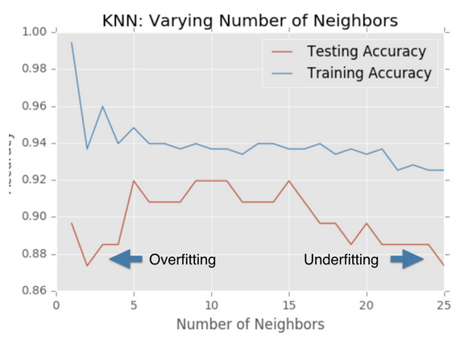

# gamle noter // Måling af modellers resultater

Nøjagtighed = korrekte resultater / totale antal af data points

Man kan ikke lave en korrekt test ved at genbruge træningsdata'et til at tjekke om modellen giver gode resultater.

Derfor opdeler man datasættet i to: 
- et træningssæt
- et test sæt

Man træner modellen med træningssættet og afprøver så modellen på testsættet. Herfra kan man sammenligne hvor mange labels som prediction har tilfælled med de allerede labeled data i testsættet.

``` python
from sklearn.model_selection import train_test_split

X_train, X_test, y_train, y_test = train_test_split(X, y, test_size=0.3, random_state=21, stratify=y)
# test_size angiver størrelsen på test-data i procent (her laver vi et testsæt ud af 30% af kildesættet)
# - hvis test_size ikke specificeres,  deles datasættet 75%/25% (træning/test)
# random_state angiver hvordan datasættet splittes ud fra noget random
# stratify sætter labels ens i både trænings og testsæt ( y er det array som indeholder labels)

knn = KNeighborsClassifier(n_neighbors=8)
knn.fit(X_train, y_train)
y_pred = knn.predict(X_test)

# giver modellen en score (%), for hvor præcise resultater den kan producere
knn.score(X_test, y_test)
```

## Model kompleksitet
- Når 'k' i 'K_nearest_neighbor' er højere, bliver modellen mindre komplex og grænsen mellem værdier bliver mere glat
  - hvis 'k' bliver for høj, kan nøjagtigheden på modellen også falde (dette kaldes `underfitting`)
- Når 'k' er lavere, får man en mere komplex model som er mere modtagelig for "støj" i data
  - hvis 'k' bliver for lav, kan nøjagtigheden på modellen også falde (dette kaldes `overfitting`)
- Det betyder at der er et sweetspot i mindten (omkring 10) som giver de bedste resultater - se graf nedenfor
  
  
